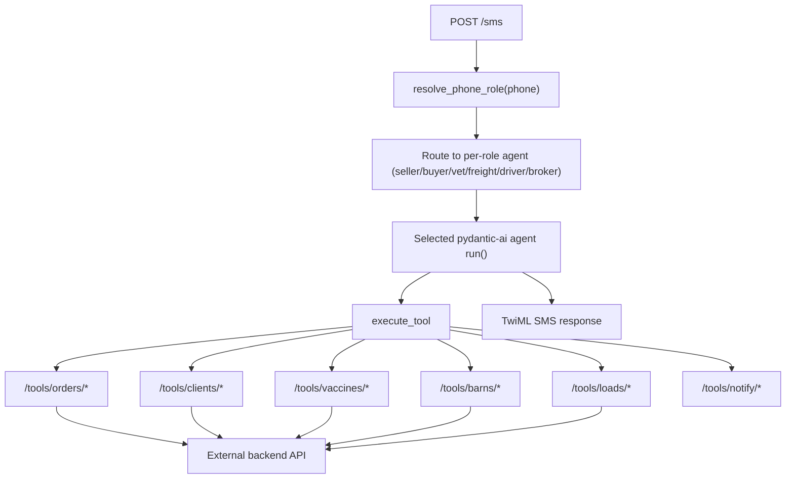

# SwineDesk Python

This is a Python program for SwineDesk, ported from the Node.js MVP to a self-contained tool-based architecture.

The MVP remains in this repository (`index.js`, `claude.js`, `broker.js`, etc.). The new Python implementation lives under `swinedesk/`.

## What it includes

- FastAPI webhook app with:
  - `GET /` health check
  - `POST /sms` Twilio SMS webhook
  - `POST /voice`, `POST /voice/gather`, `POST /voice/poll` Twilio Voice webhooks (talk to the bot by phone)
  - `GET /voice/audio/{id}.mp3` serves ElevenLabs-synthesized reply audio for Twilio `<Play>`
  - `POST /notifications/sms` backend-triggered outbound SMS (bearer-token protected)
  - `POST /docs/health-cert` health certificate webhook
- Six role-specific agents (`seller`, `buyer`, `vet`, `freight`, `driver`, `broker`), selected from backend phone→role lookup
- One-session-per-phone in-memory session store (same model as current MVP)
- Local agent wiring with filesystem-discovered tools and per-role tool allowlists
- Tools grouped by domain (`market`, `orders`, `loads`, `driver`, `grading`, `health`, `crm`, `sites`, `actors`, `reminders`, `ops`, `issues`)
- Backend API client wrapper for the Java REST API

## Architecture



## Project layout

- `pyproject.toml` - Python package/dependencies
- `.env.example` - environment variables template
- `swinedesk/app.py` - FastAPI app and endpoints
- `swinedesk/agent.py` - role-routed pydantic-ai setup and runner function
- `swinedesk/prompts.py` - per-role agent prompts
- `swinedesk/state.py` - minimal structured state model
- `swinedesk/session.py` - in-memory per-phone session management
- `swinedesk/backend_client.py` - external backend API wrapper
- `swinedesk/tools/...` - tool stubs by domain

## Session behavior (same as current MVP)

This skeleton intentionally keeps session semantics close to `conversation.js`:

- key: phone number
- one active session per phone
- inactivity timeout: 30 minutes (configurable)
- max history: 30 messages (configurable)
- cleanup loop: every 10 minutes
- store: in-memory only

Tradeoff: sessions are lost on process restart (same as current behavior).

## Tool conventions

Every tool is a `Tool` subclass with:

- `TOOL_PATH` (required for stable routing)
- `DESCRIPTION`
- `ARGUMENTS`
- `async run(arguments, state) -> dict`

Tools call the Java backend through `BackendClient`.

### Adding a new tool

1. Create a new folder under `swinedesk/tools/<category>/<tool_name>/`.
2. Add `tool.py` with a `Tool` subclass.
3. Set `TOOL_PATH` to `/tools/<category>/<tool_name>`.
4. Add argument schema with `Arg(...)`.
5. Implement the backend API call in `run(...)`, then add its `TOOL_PATH` to the appropriate role allowlist in `swinedesk/agent.py`.

The loader discovers tools from filesystem path conventions, so no central registry edit is required.

The project includes local implementations for:
- `Tool` / `Arg` base abstractions
- filesystem tool discovery
- `execute_tool` dispatcher bridge for pydantic-ai

No `expert_agents` dependency is required.

## Role-based tool isolation

The runtime initializes one independent agent per role, each with its own custom tool registry (allowlists defined in `swinedesk/agent.py`):

- **seller / buyer**: market listings/requests, order creation, price offers, auctions, load detail.
- **broker**: operational tooling — listings/matches, order matching, freight assignment (`assign_freight_company`), grading adjustment (`record_grading_adjustment`), blasts, reminders, client notes, and notifications.
- **vet**: vet-pending loads, health-cert status, vet-to-vet confirmation (`confirm_vet_to_vet`).
- **freight**: freight loads, freight-detail submission, assignment confirmation.
- **driver**: my loads (`get_my_loads`), report pickup (`report_pickup`), report offload (`report_offload`).

This prevents the model from seeing or calling role-inappropriate custom tools in normal operation.

## Local setup

### 1) Install dependencies

```bash
cd /data/swinedesk
python -m venv .venv
source .venv/bin/activate
pip install -e .
```

### 2) Configure environment

```bash
cp .env.example .env
```

Update `.env` with:

- `ANTHROPIC_API_KEY`
- `TWILIO_ACCOUNT_SID`
- `TWILIO_AUTH_TOKEN`
- `TWILIO_PHONE_NUMBER`
- `BACKEND_API_URL`
- `BACKEND_API_TOKEN`

`BACKEND_API_TOKEN` is also used to protect the backend-triggered notification webhook on SwineDesk Python, so the Java backend should send the same bearer token when calling `/notifications/sms`.

### 3) Run server

```bash
uvicorn swinedesk.app:app --reload --port 3000
```

### Testing the post-deal ladders

The Java backend exposes `POST /v1/query/admin/run-scheduler`, which advances every
load through the backend state machine and flushes due message/email tasks on demand
(instead of waiting for cron). Call it after a deal step to fire the next reminder /
notification without waiting:

```bash
curl -s -X POST http://localhost:8080/v1/query/admin/run-scheduler
```

## Twilio wiring

- Point Twilio incoming message webhook to:
  - `https://<your-domain>/sms`
- Point the Twilio number's **Voice "A call comes in"** webhook (HTTP POST) to:
  - `https://<your-domain>/voice`
- Backend-triggered SMS notification webhook:
  - `https://<your-domain>/notifications/sms`
  - Protected by `Authorization: Bearer <BACKEND_API_TOKEN>`
- Health cert automation webhook (Make/Zapier/email parser) to:
  - `https://<your-domain>/docs/health-cert`

## Voice (inbound calls)

Calling the Twilio number runs the **same agent, tools, sessions, and role
routing as SMS** — every operation available over text is available over the
phone. Twilio transcribes the caller's speech (`<Gather input="speech">`), the
transcript runs through the identical `_process_inbound` path the SMS webhook
uses, and the agent's reply is spoken back with ElevenLabs text-to-speech.

- **Confirmation texts:** when a call completes an important, state-changing
  action (listing/request submitted, deal paired, purchase order submitted,
  freight confirmed/driver details taken, grading submitted, load completed,
  reminder set, price offer answered), the spoken confirmation is also texted to
  the caller so there is a written record. See `IMPORTANT_TOOL_PATHS` in
  `swinedesk/app.py`.
- **Voice config** (`.env`): `VOICE_ENABLED`, `ELEVENLABS_API_KEY`,
  `ELEVENLABS_VOICE_ID`, `ELEVENLABS_MODEL_ID`, `VOICE_GREETING`, and
  `PUBLIC_BASE_URL` (absolute https base URL Twilio fetches reply audio from;
  leave blank to derive from the inbound request host).
- **Graceful fallback:** if ElevenLabs is unavailable (no key, no credits, API
  error), the call still works — it falls back to Twilio's built-in `<Say>`
  voice instead of failing.

## Backend bridge config

On the Java backend, enable the SwineDesk SMS bridge with:

```properties
swinedesk.notifications.enabled=true
swinedesk.notifications.base-url=https://<your-swinedesk-domain>
swinedesk.notifications.token=<same value as BACKEND_API_TOKEN>
```

If `swinedesk.notifications.token` is omitted, the backend falls back to `swinedesk.api.token`.

## Implementation TODOs for next engineer

1. Finalize backend API contracts and endpoint paths in:
   - `swinedesk/backend_client.py`
   - all tool stub `run(...)` methods
2. Replace role lookup endpoint stub:
   - `BackendClient.resolve_phone_role(...)`
3. Add real SMTP send implementation in:
   - `swinedesk/tools/notify/send_email/tool.py`
4. Add tests:
   - session timeout/capping behavior
   - webhook happy paths
   - each tool stub contract and error handling
5. Add observability/logging and production error reporting.

## Notes on migration from current Node MVP

- Node completion tags (`<<<ACTION:...>>>`) were removed.
- In Python, tool-calling should drive create/update actions directly.
- Producer/Broker role routing remains, but now role is resolved via backend API instead of env phone list.
- SMS chunking behavior remains for long responses.
